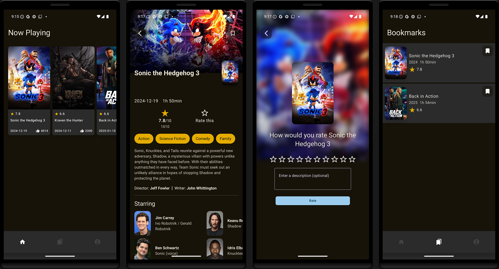

RateMovies App
==================



RateMovies is a social movie rating app designed for film enthusiasts. Just like Instagram, but for movies—rate films, share your reviews and explore ratings from other users!

It is a **work in progress** 🚧

### Features built
- Fetch of 'Now Playing' movies.
- Details screen.
- Rating screen.
- Bookmark tab with all saved movies.
- Profile tab which displays all rated movies.
- Everything is stored in Android Room and is offline first.

### Missing features
- Authentication.
- Proper profile screen (with friends list, statistics).
- Versatile main screen (search option).
- Storing profile information to cloud db.

## Tech Stack

### Core
- Compose Multiplatform [CMP](https://www.jetbrains.com/compose-multiplatform/)
- 100% [Kotlin](https://kotlinlang.org/)
- 100% [Jetpack Compose](https://developer.android.com/jetpack/compose)
- [Material3 design](https://m3.material.io/) (UI components)
- [Kotlin Coroutines](https://kotlinlang.org/docs/coroutines-overview.html) (Structured concurrency)
- [Kotlin Flow](https://kotlinlang.org/docs/flow.html) (Reactive data stream)
- [Koin](https://insert-koin.io/) (DI)


### Testing
- [JUnit4](https://github.com/junit-team/junit4) (Unit testing)

### Local Persistence
- [Room DB](https://developer.android.com/training/data-storage/room) (SQLite ORM)

### Networking
- [Ktor client](https://ktor.io/docs/getting-started-ktor-client.html) (HTTP client)
- [Kotlinx Serialization](https://github.com/Kotlin/kotlinx.serialization) (JSON serialization)

### API
- [TMDB](https://www.themoviedb.org/)

## How To Run The App
Add your [TMDB](https://www.themoviedb.org/) API key in the `gradle.properties` file:

```
 API_KEY = YOUR_API_KEY 
 ```
